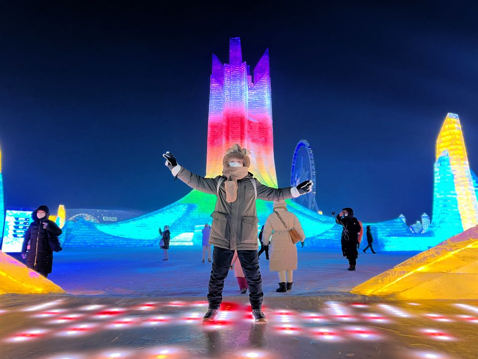
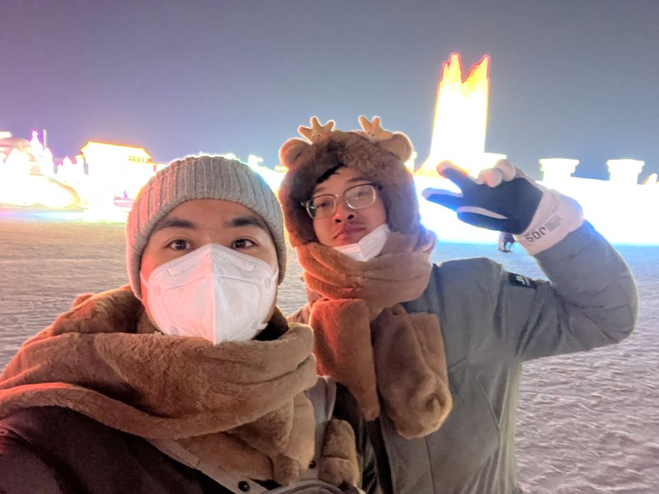
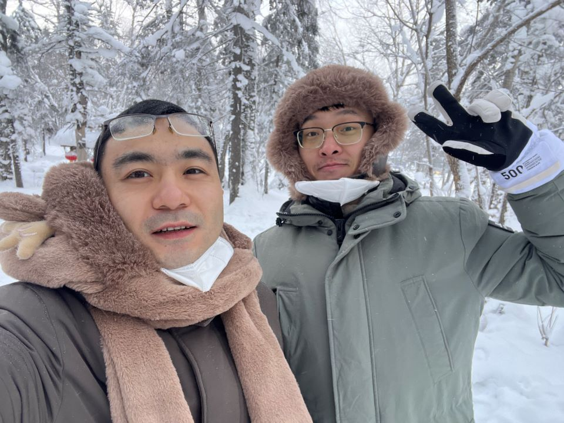

## 元旦

2022年12月30日--2023年1月2日

### 哈尔滨跨年

⛄🎇⛄🎇⛄🎇⛄

我们去雪乡跨年啦~~

🎇⛄🎇⛄🎇⛄🎇

#### 出发~~~

#### 冰雪大世界

好冷好冷~~~还好买了两个毛绒帽子

冰雕的世界真的好美，做了摩天轮，玩了雪滑梯

|  |  |  |
| -------------------------- | -------------------------- | -------------------------- |
|  |  |  |
|  |  |  |
|  |  |  |

#### 雪乡

好美的世界，满眼望去都是耀眼的雪白

|  |  |  |
| -------------------------- | -------------------------- | -------------------------- |
|  |  |  |
|  |  |  |
|  |  |  |

买了夹子做小鸭子

|  |  |  |
| -------------------------- | -------------------------- | -------------------------- |

虽然没能在跨年夜放烟花，但是看了别人放，也很开心了

|  |  |  |
| -------------------------- | -------------------------- | -------------------------- |
|  |  |  |

返程的路上，两个傻子在雪地里疯狂打滚

|  |  |
| -------------------------- | -------------------------- |

|  |  |  |
| -------------------------- | -------------------------- | -------------------------- |
|  |  |  |
|  |  |  |

在雪山上遇到了一只毛茸茸的大白狗，好可爱，它看到雪也超级开心

小赵追着大狗撒欢的跑

夜色下的哈尔滨

|  |  |
| -------------------------- | -------------------------- |
|  |  |

这个车拉大鱿鱼有点意思

### 西双版纳

从哈尔滨回来，休整了一天，然后又马不停蹄的奔向彩云之南

飞机到达昆明，机场酒店住了一晚，一大早就坐上高铁前往西双版纳

温度逐渐上升，出了高铁站，正是大中午的时候，直接脱到只剩一件薄T恤

第一天在告庄里的民宿住，晚上逛了告庄和星光夜市

璀璨的灯光、少数民族的风情、密集的人群，让人感到欢愉

好久没有看到这么多人聚在一起了，仿佛从来没有受到过疫情的影响

喝了网红星光冰咖啡，在夜市里找了一家烧烤，吃了当地烤鱼

走在江边，能听到蹦傣迪的音乐，很嗨，不过没有进去

第二天换到了洲际酒店，租了车

开车到了野生大象动物园

运气真不错，看到了一家三口野象

找了个不太好的位置看了大象表演

从动物园出来，去了小红书上推荐的曼掌村

路比较难走，算是一个比较原始的傣族村落

趁着夕阳随便逛了逛，然后回了市区

第三天上午去了XXXX和总佛寺，很美很美~~~

下午去了XXXX，很大的一尊佛

拉着小赵爬了半天山

走了玻璃栈道，小赵有点害怕哦~~

